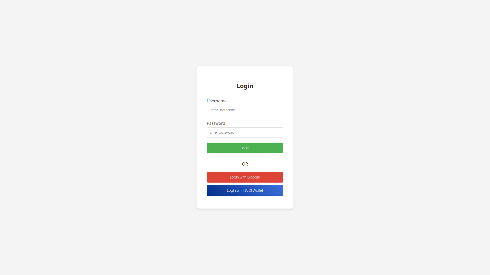

# UI

## Overview
The **EU Digital Identity Wallet (EUDI Wallet)** is a digital authentication and verification system that allows users to securely store and share their identity credentials.

## Authentication Process

### 1. Login Selection
- Users can **log in** using the EUDI Wallet or Google authentication.
- This provides flexibility for users who may not have an EUDI Wallet.

### 2. Data Sharing Consent
- Users are asked to **approve data sharing** with the requesting service.
- The following data types may be requested:
  - Age Verification (Over 18)
  - Health ID
  - IBAN (Banking Information)
  - Loyalty Membership
  - Mobile Driver’s License
  - Phone Number
  - Photo ID
  - Personal Identification (PID)
  - Power of Representation
  - Pseudonym Deferred
  - Reservation Data
  - Tax Number
- Users can either **Cancel** or **Continue** to proceed.

### 3. QR Code Authentication
- Users are presented with a **QR Code** that they must scan using their EUDI Wallet app.
- Alternatively, they can click the **"Open Wallet"** button to proceed.

## Security & Privacy
- The EUDI Wallet ensures **secure authentication** and **data privacy** by allowing users to **control the data** they share.
- Only **authorized services** can request specific credentials.

## Conclusion
The EU Digital Identity Wallet simplifies authentication while maintaining **strong security** and **privacy** standards. It enables seamless digital identity verification for users across different platforms.

---

